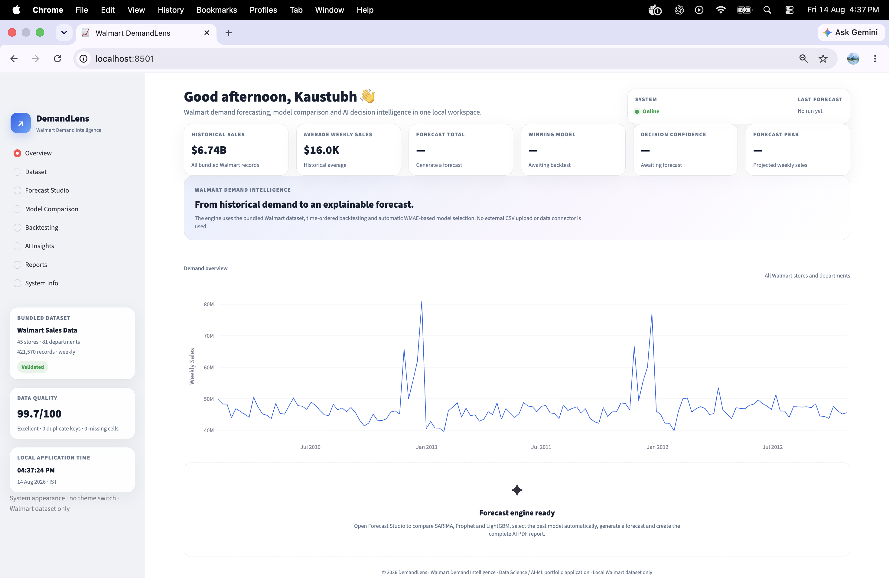
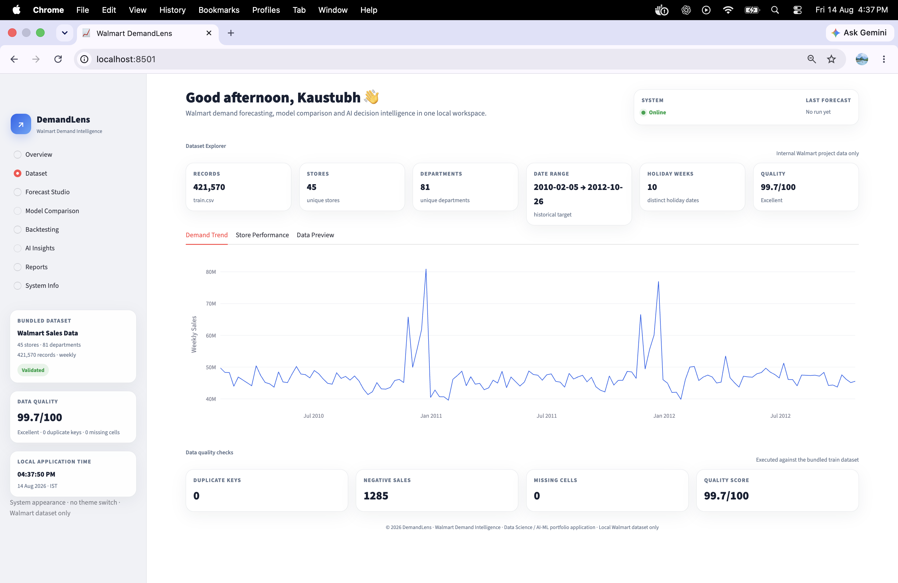
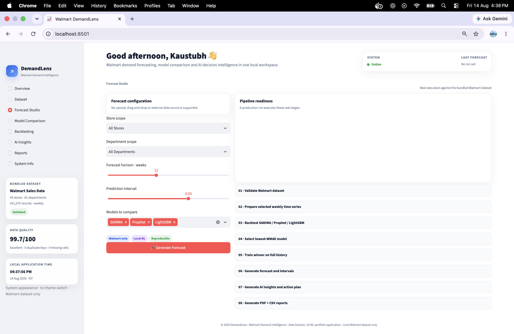
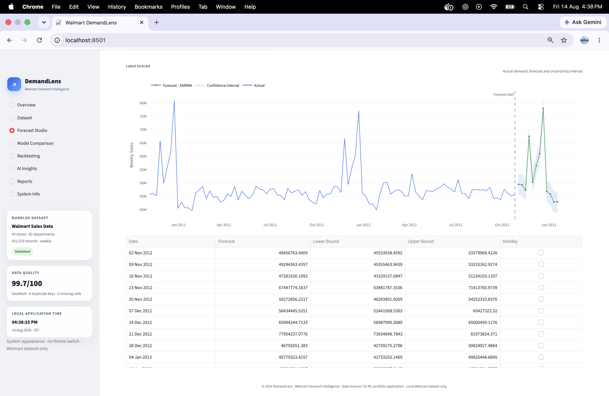
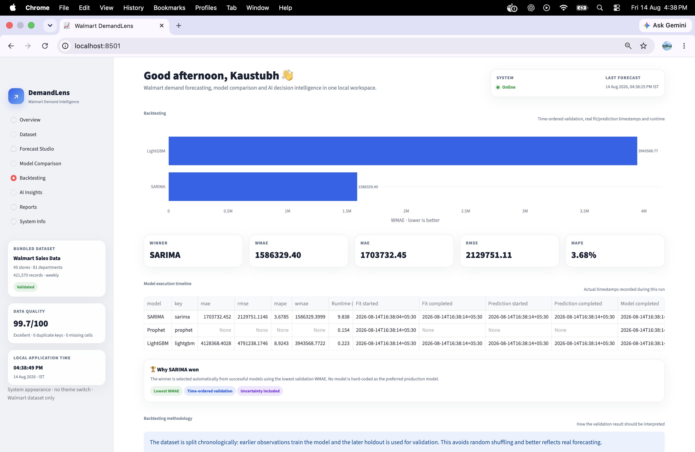
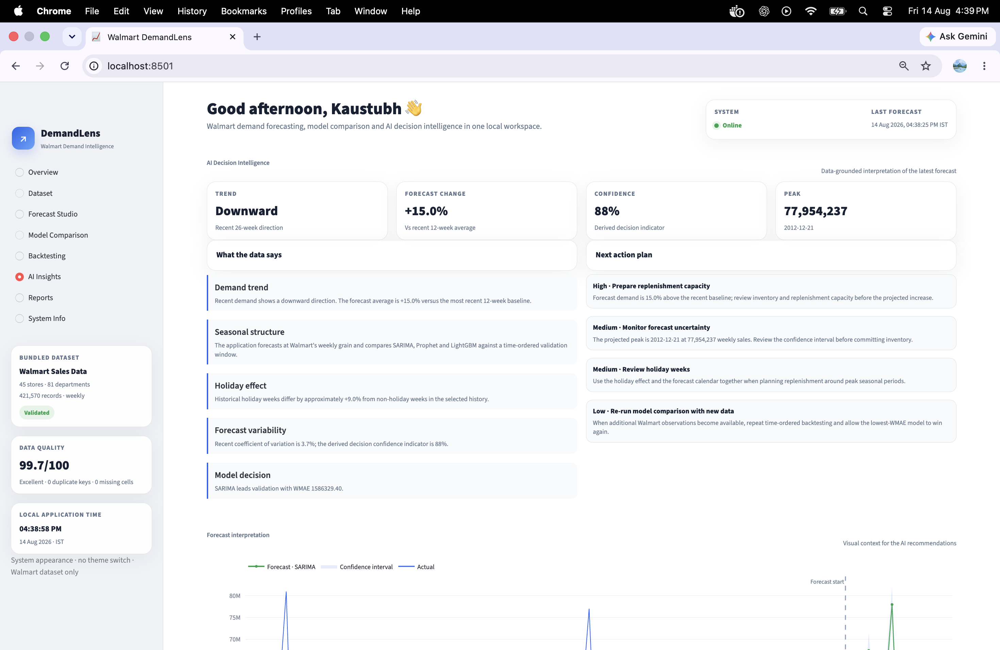
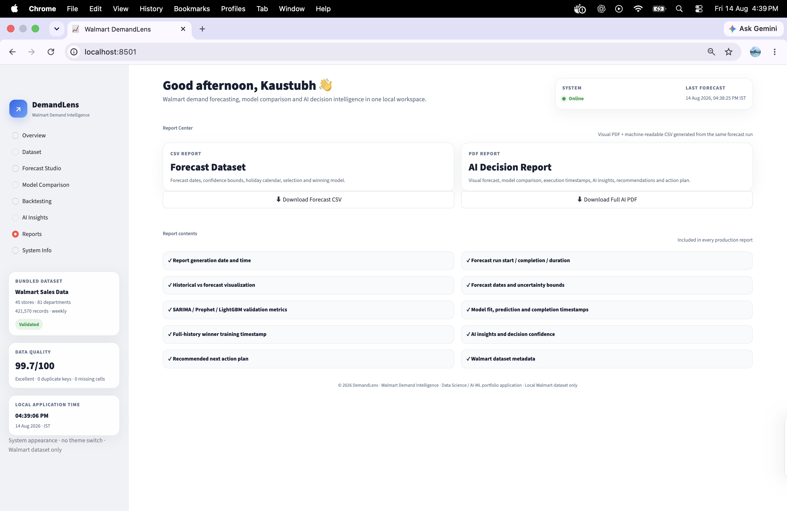
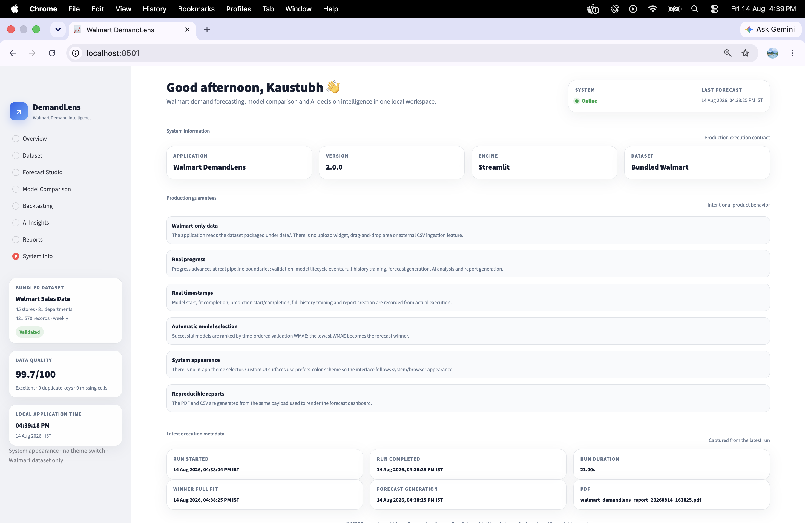

<div align="center">

# 📈 Walmart DemandLens

### Explainable Walmart Demand Forecasting & AI Decision Intelligence

**Bundled Walmart data → Validation → Time-ordered backtesting → Model selection → Forecast → AI insights → PDF / CSV reports**

<p>
  
  
  
  
  
  
  
</p>

</div>

---

## 🎯 What is Walmart DemandLens?

**Walmart DemandLens** is a production-style Streamlit forecasting application built around the bundled Walmart sales dataset. It turns historical weekly demand into a complete forecasting and decision workflow rather than stopping at a single model prediction.

The application:

- validates the bundled Walmart dataset
- profiles data quality
- aggregates sales into weekly time series
- supports Store / Department scope selection
- compares **SARIMA, Prophet and LightGBM**
- uses chronological, time-ordered validation
- ranks successful models by **WMAE**
- automatically selects the lowest-WMAE winner
- retrains the winning model on the selected full history
- generates future demand forecasts and prediction intervals
- converts forecast results into AI-style business insights
- produces a prioritized action plan
- generates PDF and CSV reports from the same forecast payload shown in the dashboard
- records real model lifecycle timestamps and execution duration
- runs locally or inside Docker

This is designed as a **Data Science / AI-ML Engineering portfolio project**, not as a generic CSV forecasting utility.

---

## ⭐ Why this project stands out

The core design principle is reproducibility and truthful execution state.

### Real pipeline progress

Progress represents actual pipeline boundaries rather than a fake timer. Model execution can report:

```text
Model started
      ↓
Model fit completed
      ↓
Prediction started
      ↓
Prediction completed
      ↓
Model completed
```

### Real timestamps

The application records actual execution timestamps for model fitting, prediction, full-history training, forecast generation and report creation.

### Automatic model selection

A model is not hard-coded as the winner. Successful validation results are ranked by WMAE and the lowest successful WMAE is selected.

### Reproducible reporting

The PDF and CSV reports are generated from the same forecast payload that powers the dashboard, reducing the risk of dashboard/report discrepancies.

---

# 📸 Product walkthrough

The following screenshots are captured from the working Walmart DemandLens application and are included in `docs/screenshots/`.

## 1. Overview dashboard

The overview provides the high-level system state, historical sales, average weekly sales, dataset quality and demand trend.



## 2. Dataset explorer

The Dataset page exposes record counts, stores, departments, date range, holiday weeks, demand trends and data-quality checks.



## 3. Forecast Studio

Forecast Studio provides store and department scope, forecast horizon, prediction interval and model selection before execution.



## 4. Forecast result

The completed run displays actual demand, forecast values, prediction intervals and the forecast table.



## 5. Backtesting and model comparison

The Backtesting page compares model WMAE and shows the model execution timeline. In the captured run, SARIMA was selected automatically as the winner.



## 6. AI Decision Intelligence

AI Insights converts the forecast into trend interpretation, forecast change, confidence, peak demand and prioritized business actions.



## 7. Report Center

The Report Center provides downloadable forecast CSV and full AI decision PDF reports.



## 8. System information

System Info exposes the application version, execution guarantees, latest run metadata and reproducibility characteristics.



---

# 🧠 End-to-end forecasting workflow

```text
Bundled Walmart Dataset
        ↓
Schema + Data Quality Validation
        ↓
Store / Department Selection
        ↓
Weekly Time-Series Aggregation
        ↓
Chronological Train / Validation Split
        ↓
┌──────────┬──────────┬──────────┐
│  SARIMA  │ Prophet  │ LightGBM │
└──────────┴──────────┴──────────┘
        ↓
MAE / RMSE / MAPE / WMAE
        ↓
Lowest Successful WMAE
        ↓
Winning Model
        ↓
Full-History Training
        ↓
Future Forecast + Prediction Interval
        ↓
AI Decision Intelligence
        ↓
PDF + CSV Reports
```

---

# 📊 Application capabilities

| Capability | Implementation |
|---|---|
| Dataset validation | Walmart schema + data-quality checks |
| Demand aggregation | Weekly time-series aggregation |
| Statistical forecasting | SARIMA |
| Prophet forecasting | Prophet |
| ML forecasting | LightGBM |
| Validation | Chronological / time-ordered holdout |
| Model selection | Lowest successful WMAE |
| Forecast uncertainty | Prediction interval |
| AI interpretation | Trend, seasonality, holiday, variability and model decision |
| Action planning | Prioritized business recommendations |
| Reporting | ReportLab PDF + CSV |
| UI | Streamlit |
| Containerization | Docker |
| Testing | Pytest |
| Linting | Ruff |

---

# 📦 Bundled Walmart dataset

The application is intentionally Walmart-specific. It does **not** expose a generic upload / drag-and-drop forecasting workflow.

The repository contains the Walmart data required by the application under `data/` and `data/raw/`.

The captured application dataset profile shows:

| Dataset property | Observed value |
|---|---:|
| Records | **421,570** |
| Stores | **45** |
| Departments | **81** |
| Historical range | **2010-02-05 → 2012-10-26** |
| Holiday weeks | **10** |
| Data quality score | **99.7 / 100** |
| Duplicate keys | **0** |
| Missing cells | **0** |

These values describe the bundled dataset displayed by the captured application and are not hard-coded as model performance guarantees.

---

# 🔬 Model comparison & backtesting

The forecasting engine compares:

- **SARIMA** — statistical time-series forecasting
- **Prophet** — additive time-series forecasting
- **LightGBM** — supervised ML forecasting with engineered time-series features

Validation is chronological rather than randomly shuffled:

```text
Earlier observations ───────────────► Later observations
       TRAINING                         VALIDATION
```

The winner is selected automatically:

```python
winner = min(successful_models, key=lambda model: model["wmae"])
```

This prevents the application from assuming that one specific model must always win.

### Captured example run

In the supplied application screenshots, the winning model was **SARIMA**:

| Metric | Captured value |
|---|---:|
| Winner | **SARIMA** |
| WMAE | **1,586,329.40** |
| MAE | **1,703,732.45** |
| RMSE | **2,129,751.11** |
| MAPE | **3.68%** |

These are values from the captured run shown in the project screenshots, not universal benchmark claims.

---

# 🤖 AI Decision Intelligence

The application converts numerical forecast output into business-readable interpretation.

The AI Insights page includes:

```text
Forecast
   ↓
Trend direction
   ↓
Forecast change
   ↓
Seasonal / holiday interpretation
   ↓
Forecast variability
   ↓
Model decision
   ↓
Decision confidence
   ↓
Prioritized action plan
```

The action plan can include recommendations such as:

- preparing replenishment capacity
- monitoring forecast uncertainty
- reviewing holiday weeks
- rerunning model comparison when new observations become available

The recommendations are generated from the forecast and dataset signals displayed by the application.

---

# 📄 Reports

## CSV report

The machine-readable forecast export contains forecast-related information including:

- forecast date
- forecast value
- lower bound
- upper bound
- holiday information
- winning model
- validation information
- generation metadata

## PDF report

The visual AI Decision Report includes:

- report generation timestamp
- forecast run start / completion / duration
- forecast configuration
- dataset profile
- actual vs forecast visualization
- model validation metrics
- model execution timeline
- winning-model training information
- AI insights
- decision confidence
- recommended action plan
- forecast appendix

---

# 🏗️ Architecture

```text
                         ┌──────────────────────┐
                         │ Bundled Walmart Data │
                         └──────────┬───────────┘
                                    ↓
                         ┌──────────────────────┐
                         │ Validation / Profile │
                         └──────────┬───────────┘
                                    ↓
                         ┌──────────────────────┐
                         │ Weekly Aggregation   │
                         └──────────┬───────────┘
                                    ↓
                       ┌──────────────────────────┐
                       │ Chronological Backtest   │
                       └────────────┬─────────────┘
                                    ↓
                    ┌───────────────┼───────────────┐
                    ↓               ↓               ↓
                 SARIMA          Prophet         LightGBM
                    └───────────────┼───────────────┘
                                    ↓
                              Validation Metrics
                                    ↓
                              WMAE Ranking
                                    ↓
                              Winning Model
                                    ↓
                          Full-History Training
                                    ↓
                           Future Forecast
                                    ↓
                    ┌───────────────┼───────────────┐
                    ↓               ↓               ↓
                 Dashboard      AI Insights      Reports
                                                    ↓
                                               PDF + CSV
```

### Repository structure

```text
Walmart-DemandLens-Streamlit/
├── streamlit_app.py
├── requirements.txt
├── Dockerfile
├── Makefile
├── ARCHITECTURE.md
├── LICENSE
├── README.md
├── docs/
│   └── screenshots/
├── data/
│   ├── train.csv
│   ├── test.csv
│   ├── features.csv
│   ├── stores.csv
│   └── raw/
├── models/
├── reports/
└── demandlens/
    ├── core/
    ├── walmart/
    ├── forecasting/
    │   ├── features/
    │   ├── models/
    │   ├── metrics/
    │   └── backtesting/
    ├── insights/
    └── reports/
```

---

# 🧰 Technology stack

| Layer | Technology |
|---|---|
| Language | Python 3.12 |
| Application | Streamlit |
| Data processing | Pandas / NumPy |
| Statistical model | Statsmodels / SARIMA |
| Forecasting | Prophet |
| ML model | LightGBM |
| Scientific computing | SciPy / scikit-learn |
| Visualization | Matplotlib / Plotly |
| Reports | ReportLab |
| Configuration | Pydantic Settings |
| Testing | Pytest |
| Linting | Ruff |
| Container | Docker |

---

# 💻 Local setup

Python 3.12 is recommended.

```bash
git clone <your-repository-url>
cd Walmart-DemandLens-Streamlit

python3.12 -m venv .venv
source .venv/bin/activate

pip install --upgrade pip
pip install -r requirements.txt
```

Run the application:

```bash
MPLBACKEND=Agg streamlit run streamlit_app.py
```

Open:

```text
http://localhost:8501
```

`MPLBACKEND=Agg` is used for safe non-GUI chart generation during report creation.

---

# 🐳 Docker

The project is Docker-ready and the container is configured for the application timezone **Asia/Kolkata (IST)**.

The image also installs `libgomp1`, required by LightGBM inside the slim Python image.

### Build

```bash
docker build --no-cache -t walmart-demandlens:2.0.0 .
```

### Run

```bash
docker run -d \
  --name walmart-demandlens \
  -p 8501:8501 \
  walmart-demandlens:2.0.0
```

Open:

```text
http://localhost:8501
```

### Check the container

```bash
docker ps
docker logs --tail 100 walmart-demandlens
docker exec walmart-demandlens date
```

### Stop / remove

```bash
docker rm -f walmart-demandlens
```

The Docker configuration explicitly sets the container timezone to `Asia/Kolkata`, keeping application execution timestamps aligned with the local IST environment.

---

# 🧪 Testing and code quality

Run the test suite:

```bash
pytest -q
```

Compile checks:

```bash
python -m compileall -q .
```

Lint:

```bash
ruff check .
```

Or use the Makefile:

```bash
make install
make run
make test
make lint
make compile
```

---

# ⏱️ Execution and reproducibility guarantees

The application intentionally distinguishes **pipeline state** from fake elapsed-time progress.

### Model lifecycle

```text
started
  ↓
fitted
  ↓
predicted
  ↓
completed
```

### Report reproducibility

The same forecast payload is used to drive the dashboard and generate the PDF / CSV outputs.

### Application appearance

There is no in-app theme selector. The custom UI follows the system/browser appearance preference.

---

# 📌 Portfolio positioning

This project demonstrates practical skills across:

**Data Science**

- time-series forecasting
- feature engineering
- model evaluation
- chronological validation
- uncertainty intervals
- automated model selection

**AI / Decision Intelligence**

- forecast interpretation
- business-oriented recommendations
- decision confidence indicators

**ML Engineering**

- modular forecasting components
- execution lifecycle tracking
- reproducible report generation

**Product Engineering**

- multi-page Streamlit dashboard
- interactive forecasting workflow
- dataset profiling
- downloadable reports

**DevOps / Deployment**

- Docker containerization
- production-oriented runtime configuration
- reproducible local execution

---

# 🗺️ Future improvements

Possible next iterations include:

- automated model retraining
- hyperparameter optimization
- model registry / promotion workflow
- model drift monitoring
- production monitoring and alerting
- authentication / RBAC
- automated CI/CD deployment
- richer forecast explainability

---

# 👨‍💻 Author

## Kaustubh Suryawanshi

Data Science / Machine Learning Engineering portfolio project focused on:

**Data Science · Machine Learning · Time-Series Forecasting · AI Decision Intelligence · MLOps · Product Engineering**

GitHub: [github.com/kaustubh18work](https://github.com/kaustubh18work)

LinkedIn: [linkedin.com/in/kaustubh-suryawanshi18](https://linkedin.com/in/kaustubh-suryawanshi18)

Email: `kaustubh18.work@gmail.com`

---

# 📄 License

This project is distributed under the MIT License.

**Copyright © 2026 Kaustubh Suryawanshi**

See [`LICENSE`](LICENSE) for the complete license text.

---

<div align="center">

## ⭐ Walmart DemandLens

**Forecast demand. Explain the signal. Support better decisions.**

Built with **Python · Streamlit · SARIMA · Prophet · LightGBM · Docker**

</div>
